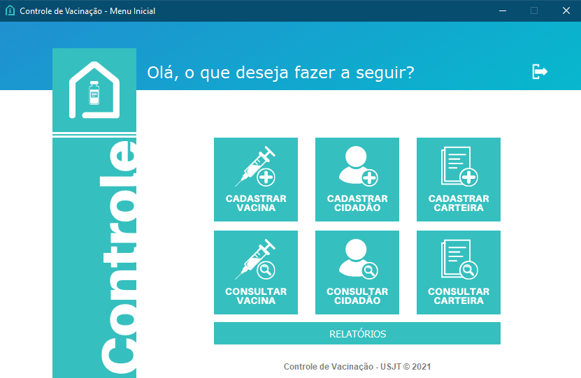
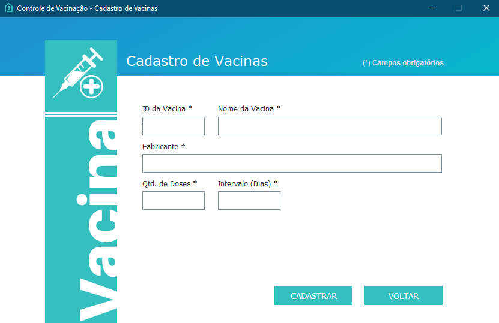
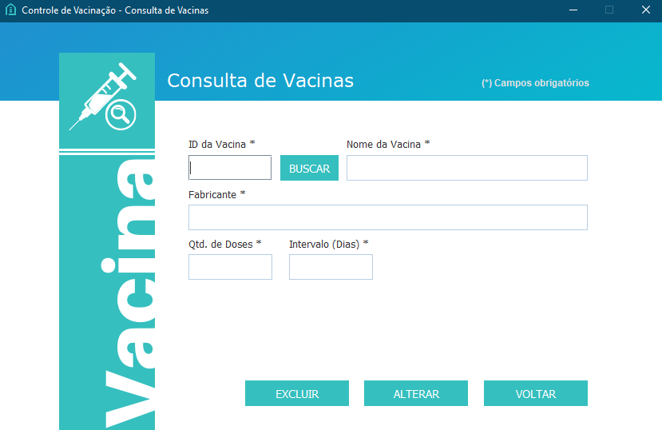
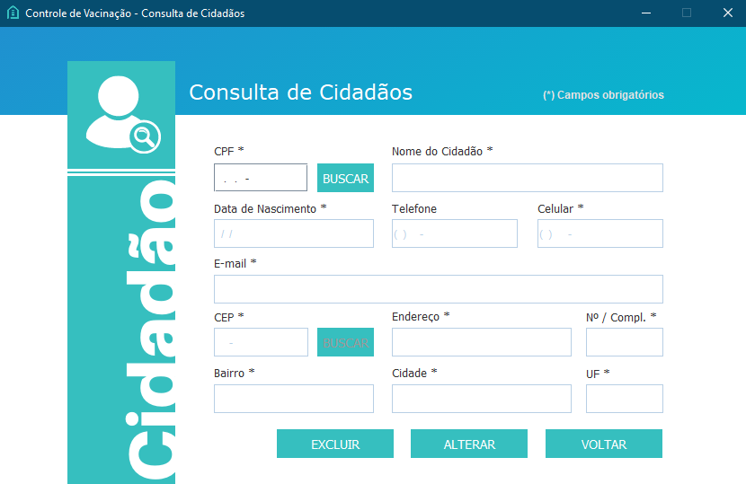
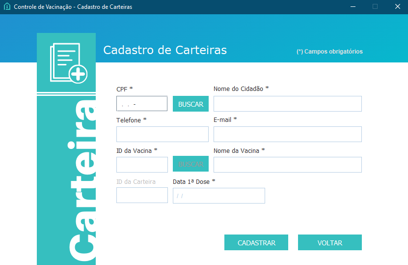
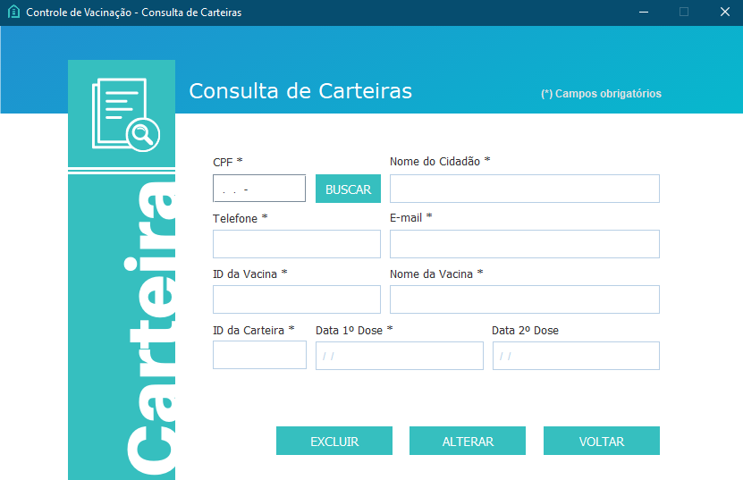
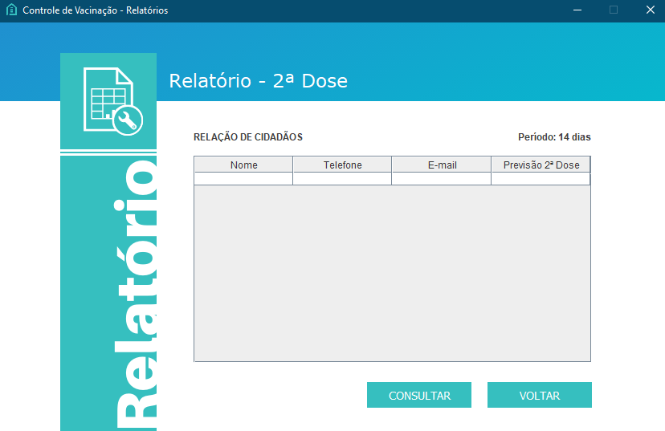

<h1 align="center">
   Controle de Vacinação
</h1>

 

## :camera: Demonstração

## :rocket: Tecnologias

Esse projeto foi desenvolvido com as seguintes tecnologias:

✔️Java

✔️MySQL

## 💻 Projeto

O principal objetivo deste projeto é a realização de um sistema de controle de vacinas , que tem como funções básicas o cadastro de cidadãos , vacinas e de carteiras , e também a consulta dos mesmos . Visamos o desenvolvimento do nosso projeto para ser o mais intuitivo possível para os responsáveis de saúde que fazem parte dos postos de vacinação contra COVID-19 em todo o país.

## ⚙ Configuração

Atenção! É necessário que você tenha o banco MySQL configurado e o JDK instalado para poder utilizar a Aplicação!
